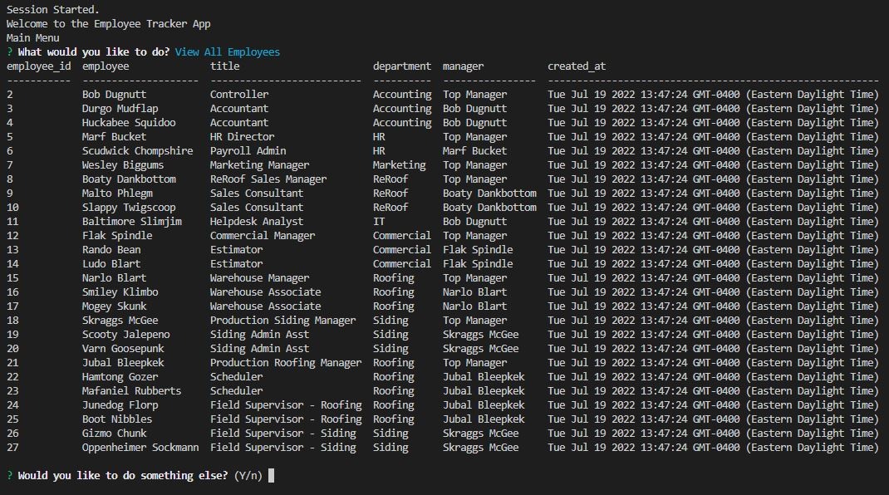

# Employee Tracker App

  ## Badges
  \
  

  

  

  

  
  
  ## Description
  A command line app that allows users to manage a MYSQL database of employees, roles, and departments.

  
  ## Table of Contents

  - [Installation](#installation)
  - [Usage](#usage)
  - [Contributing](#contributing)
  - [Testing](#testing)
  - [Questions](#questions)
  - [License](#license)

  ## Installation

   - This app requires Node.js, NPM, and MySQL to be installed on your PC, or a MSQL server that you can connect to.
   - Download the .zip or clone the repository from GitHub.
   - Navigate to the root folder of the app and run "npm install"
   - Create a .env file in the root directory with "DBPW=YourMySQLRootPassword"
   - Open MYSQL CLI in the root directory and run "source db/db.sql" and "source db/schema.sql".
   - Alternatively, you can run "source db/resetDB.sql" to set up and populate the database with mock data.
   - If you are using a remote MYSQL server, edit the db/connection.js file with your connection info.
  
  ## Usage
   - Run from the command line by navigating to the root directory and running "npm start"
   - Choose from the menu options and select or enter data when prompted.
   - Quit by selecting Exit or by typing 'n' when asked if you'd like to do anything else.
   - PLACEHOLDER FOR VIDEO RECORDING

  
  ---
  
  ## Contributing
  
  Feel free to fork and edit this repo for your own experimentation. However, I will not be actively maintaining this app or merging pull requests.
  
  ## Testing
  
  No testing is needed at this time.

  
  ## Questions
  
  If you have any questions regarding this project, please reach out to me here:

  - GitHub: [MosNes](https://github.com/MosNes)
  - Email: 7hekarl@gmail.com

  ## License

    This project is not covered under any license.
